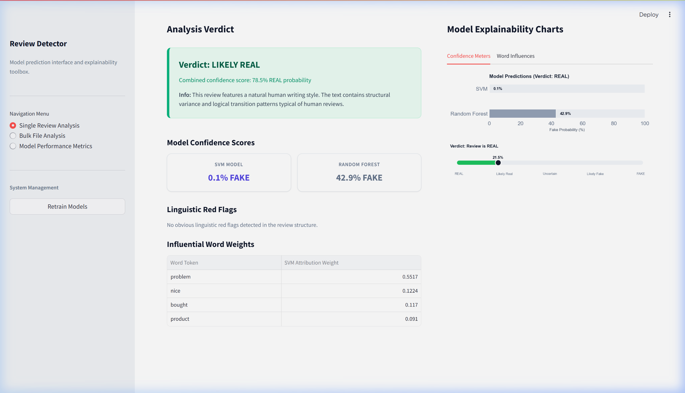

# Fake Review Detector

A clean, simple, and professional machine learning pipeline for detecting fake product reviews. The system trains a Support Vector Machine (calibrated for probability estimation) and a Random Forest Classifier on a dataset of 40,000+ reviews. It provides an interactive command-line interface and a premium Streamlit web dashboard for real-time review analysis, bulk-processing of review files, and local interpretability explanations.

## Features

- **Dual Model Approach**: Compares a Calibrated Support Vector Classifier (calibrated LinearSVC) and a Random Forest Classifier.
- **Local Interpretability**: Uses model coefficients to explain predictions word-by-word, displaying word attribution scores and customized word clouds.
- **Interactive Web App**: Streamlit dashboard with dedicated views for single analysis, bulk file processing, and metric comparisons.
- **Terminal Interface**: A text-based console loop for running predictions and performance audits.
- **Robust Preprocessing**: Integrates regex-based cleaning and Porter Stemming with safety fallbacks.

## Web Dashboard Screenshots

### 1. Analysis Verdict and Linguistic Red Flags
This view shows the verdict, combined confidence, model scores breakdown, linguistic red flags, and token attributions for the input review:


### 2. Confidence Comparison and Gauge
This tab displays the model prediction comparison bar chart and verdict indicator gauge:


### 3. Word Influence and Custom Word Cloud
This tab displays local word attribution weights (red for fake indicators, green for real indicators) and word cloud distributions:


## Installation

### Prerequisites
Make sure Python 3 is installed on your system.

### Install Dependencies
To install the required Python packages, navigate to the project root directory and run:
```bash
pip install -r requirements.txt
```
*Note: The script will safely download the NLTK stopword corpus on the first run. If offline, the code automatically falls back to built-in fallback stopwords.*

## Usage

### 1. Train the Models
To download the review dataset, preprocess the text, train the models, and cache metrics, execute:
```bash
python train_models.py
```
This script saves the trained models (`svm_model.pkl`, `rf_model.pkl`), vectorizer (`vectorizer.pkl`), and evaluation logs in the `models/` directory.

### 2. Start the Streamlit Web Application
To run the interactive web interface, run:
```bash
streamlit run app.py
```
This launches a local server and opens the dashboard in your default browser (typically at `http://localhost:8501`).

### 3. Run the Terminal Interface
To launch the text-based console interface, run:
```bash
python main.py
```

## Model Performance

The classifiers are evaluated on a balanced 20% test split:

| Performance Metric | SVM Model (Calibrated) | Random Forest Model |
| :--- | :--- | :--- |
| **Accuracy** | **86.80%** | 78.94% |
| **Precision** | **86.26%** | 77.95% |
| **Recall** | **87.52%** | 80.69% |
| **F1-Score** | **86.89%** | 79.30% |

- **SVM** finds a separating hyperplane in the TF-IDF feature space and is highly optimized for text representation.
- **Random Forest** uses 100 decision trees to classify the text, preventing overfitting.

## Dataset Acknowledgments
This project uses the Fake Reviews Detection dataset containing 40,412 reviews divided into 20,215 authentic human reviews and 20,197 computer-generated fake reviews.
